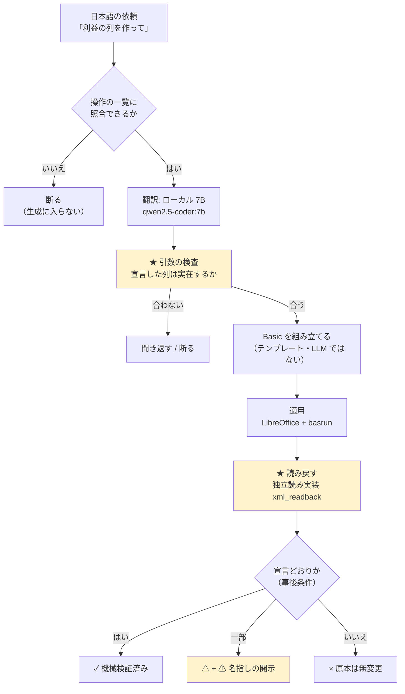

# ailine

**自然言語の依頼を、ローカルの 7B モデルが LibreOffice Basic に翻訳し、`.xlsx` に適用し、
★ 適用したファイルを開き直して読み戻し、確かめられた時だけ `✓` を出す。**

> **この道具の値打ちは「できること」ではなく、「できたと言わないこと」にあります。**
> 自然言語 → Excel 自動化そのものは、もう珍しくありません。
> 珍しいのは、**確かめられなかった時に `✓` を出さない**という拒否の規律のほうです。

```
✓  機械検証済み   適用後に読み戻して、宣言どおりだと確かめられた
△  一部だけ確認   確かめられた範囲と、確かめられなかった範囲を名指しで開示する
×  失敗           原本には触っていない（作業結果は隣に残す）
```

---

## ★ はじめに（期間についての開示）

この repo は**課題の提示より前**（2026-08-10）から個人で作っていたものです。
課題期間（8/26〜9/2）にやったのは、**新機能の追加ではなく、検証と処置**でした。

| | |
|---|---|
| repo 全体 | 2026-08-10 起点・200 commit 超 |
| 課題期間にやったこと | ① 外部の目による盲検レビュー 5 面 → 出た**致命 10 件を全件処置** ② 表の基本操作（行の追加・削除／列の削除／1 セル書換） ③ 評価者が触れる GUI |
| 課題期間に**やらなかったこと** | 新機能の拡張、単一ファイル（<!-- MAIN_FILE_LINES -->15502<!-- /MAIN_FILE_LINES --> 行）の分割（理由は「4. 判断・制約・学び」） |

土台が既存であることを踏まえて読んでいただくために、**何を今週やったか**は
`git log --since=2026-08-26 --oneline` で追える形にしてあります。

---

## 1. アイデア

### ひとことで

**AI が書いた結果を、AI に検算させない Excel 自動化。**
翻訳は LLM がやり、検証は機械（決定的なコード）がやる。役割をはっきり分けています。

### 想定ユーザー

**AI の出力を、検算せずに業務へ流せない人。**
具体的には、中小企業・個人事業の事務や経理で、毎月同じ形の Excel を手で直している人。
この層は「たぶん合っています」を受け取れません。間違えた請求書は取り返しがつかないからです。

### 解決したい課題

Excel の定型作業を自動化したい。でも既存の AI ツールには 2 つの壁があります。

1. **検算できない。** 出てきた表が正しいかは、結局人が全部見ることになる。
   それなら手でやったほうが早い、という判断になります。
2. **社外に出せない。** 売上・単価・取引先名は、外部 API に投げられないことが多い。

### 提供する価値

- **`✓` の意味が 1 行で言える。**
  `✓` は「あなたのファイルは**今**こうなっている」（適用後に読み戻して確かめた事実）。
  推測でも、モデルの自己申告でもありません。
- **確かめられない範囲は、`⚠` で名指しして `✓` を取り下げる**（`△` に落とす）。
  「全部だめ」でも「全部よし」でもない、という言い方を機械が持っています。
- **外に 1 バイトも出ない。** ollama（ローカル）と LibreOffice だけで完結します。API 費用 $0。
- **戻せる。** 既定で原本を直接書き換えますが、書く前に必ずバックアップを取り、
  `ailine undo` でバイト単位で戻せます。

### 主な利用場面

- 月次の売上表に「原価を引いた利益の列」を足して、合計行を付ける
- 取引先マスタから単価を転記する（VLOOKUP 相当）
- 同じ形の月次ブックが並んだフォルダを 1 冊に縦積みする
- CSV を、0 落ち（先頭ゼロの品番が数値化される事故）を作らずに取り込む

### アイデアのきっかけとなった体験や観察

生成 AI に Excel の操作を書かせると、**動きはするが合っているか分からない**コードが出てきます。
確かめようとすると結局全部読むことになり、自動化した意味が消えます。

決め手になったのは、自分の実装で踏んだ事故のほうです。
**検算のコードが、検算される対象と同じ関数を使っていた**ため、
「合っている」という判定が**恒真**になっていました。
外部の目に盲検で測らせたら、この形の欠陥が**同じ期間に 4 件**出ました。

> ここから設計が決まりました ──
> **検算は、対象と別の実装で、入力側から数え直す。**
> 例: 適用後の検証は openpyxl ではなく、`src/ailine_core/xml_readback.py`（xlsx の XML を
> 直接読む独立実装）で読み戻します。同じライブラリの同じ読み方では、同じ嘘をつくからです。

### なぜ AI を使うのか

**翻訳（人の言葉 → 操作の意図）は AI にしかできません。**
「みかんの下に梨を追加して」の「下」がどの行かは、規則では書き切れません。

**逆に、検証は AI にさせません。** 行数を数える・値を突き合わせる・列がずれていないか見るのは、
決定的なコードのほうが速くて正確で、しかも**間違え方が予測できます**。

この線引き自体が、この道具の設計の中心です。

### 実際に利用される可能性や、事業としての展開可能性

- **すぐ使える形**: ローカル完結・API 費用 $0・PC 1 台で動く。
  情シスの承認が要らないのは、社外にデータが出ないからです。
- **横に広がる形**: 「適用して、読み戻して、確かめられた時だけ `✓`」という構造は
  Excel 固有ではありません。同じ形が、書類生成・データ移行・設定変更に載ります。
- **正直な現状**: 今は PoC です。売れる状態ではありません（既知の問題は「4.」に名指しで書きます）。

---

## 2. プロトタイプとデモ

### デモ

- **デモ URL**: ありません。**ローカル実行が前提**の設計（データを外に出さない）のため、
  ホスティングしていません。手元で `python gui/server.py` を打つと `http://127.0.0.1:8760/` が開きます。
- **動画 / GIF・スクリーンショット**: `docs/` に置きます。

### 代表的な利用の流れ

```
① ファイルを選ぶ        GUI からエクスプローラで .xlsx を開く
        ↓               → 機械が読んだこと（シート名・見出し・行数）を先に表示する
② 日本語で頼む          「売上から原価を引いた利益の列を作って」
        ↓               → LLM の出力はここで止まり、解釈行として人に見える
③ 実行                  下書き（原本のコピー）に適用 → 読み戻して検証
        ↓
④ 判定を見る            ✓ / △ / × と、変わった箇所、⚠ の理由
        ↓
⑤ 原本に反映            納得したら反映（バックアップ + undo つき）
```

**③ が下書きに対して行われる**のが要点です。原本は、人が「反映」を押すまで変わりません。

### 実装範囲

#### 主な機能

`ailine ops` が出す一覧が正です（この表は登録簿から自動生成されるので、文書とずれません）。
**29 操作**が登録されています。

| 分類 | 操作 |
|---|---|
| 並べ替える | SORT |
| 計算する | COMPUTE_COLUMN / AGGREGATE / APPEND_TOTAL / PIVOT |
| 表を編集する | LOOKUP_FILL / MERGE / INSERT_ROWS / **ADD_ROW** / **DELETE_ROWS** / **DELETE_COLUMN** / SET_COLUMN_VALUE / **SET_CELL_VALUE** / **SWAP** / **ADD_COLUMN** / **SET_WHERE** / EXTRACT / **EXTRACT_COLUMNS** / SPLIT_CELL / DEDUP / REPORT_PER_ROW / FORMAT_MAP |
| 見た目を整える | BOLD / FILL_COLOR / NUMBER_FORMAT / CENTER_ALIGN / DRAW_BORDERS / AUTOFIT |
| グラフを作る | CHART |

（**太字**は課題期間に足した、表計算の基本操作です。）

**一覧に無い依頼は、生成に入らず断ります。** それらしいコードを作って見せません。

#### AI が担う役割

| 工程 | 担当 |
|---|---|
| 依頼文 → 操作と引数（DSL）への翻訳 | **AI**（ローカル 7B） |
| 引数が表の実体と合っているかの検査 | 機械（`verify_dsl_args`） |
| DSL → LibreOffice Basic の生成 | 機械（テンプレート・LLM ではない） |
| 適用 | LibreOffice（basrun 経由） |
| 適用後の読み戻しと判定 | 機械（独立読み実装） |

★ **AI が触るのは最初の 1 工程だけ**です。生成される Basic は平文で残り、`git diff` で読めます。

#### 実装済み

- 上の 29 操作（翻訳 → 検査 → 生成 → 適用 → 読み戻し検証 → 差分表示）
- 原本への直接反映と `ailine undo`（世代つき・復元自体も可逆）
- フォルダ単位の処理（棚卸し / 縦積み / 条件抽出 / 検算の単独再実行）
- CSV の読み取り検疫（0 落ちを作らない）と CSV / PDF への書き出し（書いたものを読み戻して照合）
- 語彙外の依頼に対する「もしかして」提案と、独自の言い回しの登録
- GUI（前後の表・書式の反映・下書きと undo・複数ファイル・確認ダイアログ）

#### モックまたは手動処理

- **GUI のファイル選択と保存**は OS のダイアログ（tkinter）を呼びます。ブラウザ内で完結しません。
- **グラフ・中央揃えなどの見た目**は、GUI の表では確認しきれません。
  「LibreOffice で開く」ボタンで実物を開いて確認する形にしています（見た目の判定は人がやる）。

#### 未実装

- **計算列の置き場所**。`ADD_COLUMN`（空の列／名前つきの列）は「原価の右に」で置けるが、
  **計算列**（「売上から原価を引いた利益の列」）はまだ右端に付く。位置指定が効かない。
- `.ods` を渡した時に生の traceback が出る（`--help` は 3 箇所で対応を約束しているのに）
- undo の redo（戻しすぎた時に進めない）

（それぞれ「なぜ今やらないか」は「4. 判断・制約・学び」に書きます。）

### 評価者が確認できる操作手順と期待結果

**A. 依存を一切入れずに確かめられること**（LibreOffice も ollama も不要）

```bash
pip install -r requirements-dev.txt
python -m pytest tests -q -m "not local"
```

期待: 全件緑（<!-- TOTAL_TESTS -->2637<!-- /TOTAL_TESTS --> 本のうち、実機が要る 27 本を除いた範囲）。
★ この 2 つの数は `tests/test_local_test_count.py` が実測と突き合わせています ──
文書の数字を、人の記憶で守らないためです。

**B. 実機で確かめられること**（LibreOffice + ollama が要る・「5. セットアップ」の後で）

| # | やること | 期待される結果 |
|---|---|---|
| 1 | GUI で `demo/2_売上.xlsx` を開く | 操作前の表が、書式つきで表示される |
| 2 | 「売上から原価を引いた利益の列を作って」→ 実行 | 解釈行（操作名と対象列）が出た後、`✓ 機械検証済み`。利益列が増える |
| 3 | 「みかんの下に梨を追加して」→ 実行 | みかんの**次の行**に梨が入る（末尾ではない） |
| 4 | 「梨の売上を2000にして」→ 実行 | 梨の行の売上だけが 2000 になる（列全体ではない） |
| 5 | 「原価の右に備考の列を追加して」→ 実行 | 原価と利益の**間**に空の備考列が入る。利益の式は壊れない |
| 6 | 「原価が500以上の項目のチェック列に「◎」を付けて」→ 実行 | 原価 700/900 の行だけに ◎ が付く。300 の行は空のまま |
| 7 | 「みかんとぶどうを入れ替えて」→ 実行 | 2 行が入れ替わる。**利益の式は自分の行を指したまま**（値を交換する実装だと、ここで各行の金額が他の行の値になる） |
| 8 | **undo** を押す | 1 つ前の状態にバイト単位で戻る |
| 9 | ★ `demo/3_売上_欠けあり.xlsx` で 2 を繰り返す | **`✓` が出ない。** 「検証できていない行がある」と名指しで出て `△` に落ちる |
| 10 | ★ 一覧に無い依頼（例:「画像を挿入して」）を出す | **生成に入らない。** 「何をしますか」と聞き返し、`ailine ops`（頼める操作の一覧）へ誘導して終わる（終了コード 3）。コードは 1 行も書かれない |

★ **9 と 10 がこの道具の山場です。** 動くところではなく、**`✓` を出さないところ**を見てください。

---

## 3. 技術構成

### 全体構成と処理の流れ



黄色が、この道具が普通と違うところです ── **入口で疑い、出口で数え直す。**

### 使用した AI・モデル

| 用途 | モデル | 置き場所 |
|---|---|---|
| 依頼文 → DSL の翻訳 | `qwen2.5-coder:7b`（既定・差し替え可） | **ローカル**（ollama） |
| 開発（実装の記述） | Claude Opus（Claude Code） | 開発時のみ・製品は使わない |

**製品の実行時に外部 API は 1 つも呼びません。**

### 使用したライブラリ・API・MCP・CLI など

| | |
|---|---|
| 実行時の依存 | `openpyxl` のみ（Python 3.10+） |
| 外部プロセス | LibreOffice（headless）、[basrun](https://github.com/namakoo-dev/basrun)（自作・MIT・別 repo）、ollama |
| GUI | **Python 標準ライブラリのみ**（`http.server` + 単一 HTML）。フレームワークなし |
| テスト | pytest |
| 開発ツール | Claude Code（「6. AI開発ツールの利用」） |

★ GUI に依存を足さなかったのは、**評価者の環境で `pip install` が 1 つ増えるたびに、
動かない可能性が増える**からです。`scripts/ci_parity.py` が、宣言していない依存の混入を止めています。

### 技術や構成を選んだ理由

| 選んだもの | なぜ |
|---|---|
| **LibreOffice Basic 経由での適用** | openpyxl で書くと、条件付き書式・図形・ピボット・VBA が**黙って消えます**。Basic なら実アプリが開いて保存するので、触っていない要素が残ります |
| **ローカル 7B** | 想定ユーザーのデータは外に出せません。天井は低いですが、**外した時に `✓` を出さない**設計なので、精度が主張の中心にありません |
| **DSL を挟む**（依頼文 → DSL → Basic） | LLM に直接コードを書かせると、機械検証できません。DSL に落とせば、**引数を実体と突き合わせられます**（その列は実在するか、数値か） |
| **読み戻しに openpyxl を使わない** | 書き手と読み手が同じライブラリだと、同じ勘違いをします。`xml_readback` は xlsx の XML を直接読む**独立実装**です |
| **GUI は薄い殻** | `✓ / △ / ×` は `ailine run --json` の返り値を**そのまま映すだけ**。GUI が判定を導いたら、それは 2 つ目の実装で、今週潰してきた欠陥の新造になります |

### 設計・実装で工夫したこと

1. **判定には三項が要る（依頼 / 宣言 / 実体）。**
   「宣言した列に書けたか」だけを見ると、**依頼と宣言がずれていた時に恒真**になります。
   3 つを別々に持ち、突き合わせています。

2. **分母は入力側から取る。**
   「何行あるか」を出力から数えると、消えた行が分母からも消えて「欠落 0」になります。
   物理的な使用範囲（`data_extent`）から数え、走査で見た範囲との差は `⚠` に変えます。

3. **`⚠` が 1 つでも立てば `✓` は出ない。**
   これを各所の `if` で書くと必ず片方を書き忘れるので、**1 つの関数**
   （`count_suspicious_advisories`）に畳み、呼び出し側に判断を持たせていません。

4. **消えたものは差分に出ない。**
   ゴールデンテストは「出るもの」しか守れません。テストが全部緑のまま致命が 3 件出たので、
   **番人自身に変異試験**（わざと壊して赤くなるか確かめる）を課しています。

5. **断れない時は開示する。**
   事故と正当な操作が機械的に区別できない場面では、拒否も黙認もせず、
   **何が確かめられなかったかを名指しで書き**、`✓` を取り下げます。

### 安全性や権限制御で考慮したこと

| 危険 | 対処 |
|---|---|
| 原本を壊す | 既定で反映前にバックアップ。`ailine undo` で世代を遡れる。**復元自体も可逆**（戻す前の状態も退避する） |
| 書き換えの取りこぼし | 反映は**原子的**（一時ファイルを作って `os.replace`）。失敗したら原本は無変更。かつては失敗時に原本が 0 バイトになり「変更していません」と報告する経路がありました（盲検で発覚・処置済み） |
| 意図しない上書き | 既存データを持つ列に書く場合は、指定が無くても確認を挟む（対話なら y/N、非対話なら終了コード 7） |
| 飾りの消失 | LibreOffice 往復で失われる要素（条件付き書式・図形・ピボット・VBA）を検出したら、**原本に触る前に**申告して止まる |
| 同時実行 | `ailine run` は同時に 1 本だけ（別プロセスが動いていれば待たずに即エラー） |
| 情報の流出 | 外部 API を呼ばない。GUI は `127.0.0.1` にのみ bind する。CI でも外部接続を要さないことを確認している |
| 語彙外の操作 | 生成に入らない（それらしいコードを作って見せない） |

---

## 4. 判断・制約・学び

### 限られた時間で優先したこと

**新機能ではなく、既に在るものの検証と処置**に全部を使いました。
順番は「取り返しのつかなさ」で決めています ── 静かに壊れるものが先です。

1. 原本を壊す経路（データが消えるのに、消えていないと報告する）
2. 検算が恒真になっている経路（`✓` が意味を失う）
3. 評価者が触れる形（GUI）
4. 表計算の基本操作（行の追加・削除ができないと道具として成り立たない）

### 作らなかったことと、その理由

| 作らなかったもの | 理由 |
|---|---|
| **単一ファイルの分割** | 割るべきです。割らなかったのは、**挙動を変えずに割ったことを確かめる番人**を用意できていないからです。代わりに行数を「一致」で縛る番人（`test_line_budget`）を置き、増減が必ず差分に出るようにしています |
| **計算列の位置指定** | 列の追加そのものは相対位置で置けます（`ADD_COLUMN`）。計算列だけ右端固定なのは、書き込み先の列を決める箇所（`_declared_new_column_letter`）が右端を前提にしているためで、そこを解く作業を今回の範囲に入れませんでした |
| 新しい操作の追加 | 未確認の致命を抱えたまま数を増やすと、確かめる対象が増えるだけです |
| 多 OS 対応の CI | Windows 前提（パス表現と LibreOffice の起動）。まず確実に緑になる 1 OS で始めました |

### うまくいかなかったこと

- **検証が恒真だった。** 検算のコードが、検算される対象と同じ関数を使っていました。
  盲検で指摘されるまで、テストは全部緑でした。
- **番人が「在るのに鳴らない」形が 4 件。** ガードは書いてあるのに、本番の経路に配線されて
  いませんでした（本番は別の関数を通っていた）。**在ることと効くことは別**です。
- **同じ直しを片側だけに入れた。** 経路が 2 本ある所で片方だけ直す事故を、3 日で 3 回。
  処方を「両方直す」から「**1 つの関数に畳んで、呼び出し側に持たせない**」に変えました。
- **手元にあるから見えない依存。** LibreOffice・Pillow・ollama が開発機にあるせいで、
  依存に宣言していないのに動いていました。CI で 4 回赤くなって気づきました。

### 現在の制約や既知の問題

**PoC です。業務での本番利用はできません。** 名指しで書きます。

- `.ods` を渡すと生の traceback が出る（`--help` は 3 箇所で対応を約束しているのに）
- `ailine stop` が、自分が漏らした LibreOffice プロセスを見つけられない場合がある
- PDF 照合で、折り返した行を取りこぼす（`xfail strict` で印を残してあります）
- **追加した行に、既存の式は引き継がれない**（「みかんの下に梨を追加して」の後、梨の行の利益列は空のまま）── 宣言した値だけを書くので `✓` は正しいが、人が期待するものとは違う
- undo に redo が無い（戻しすぎると進めない）
- 珍しい UNO 操作は当たり率が落ちる（Basic + UNO は学習データが薄い）
- 人が同じファイルを開いたまま実行した場合の挙動は未検証
- **翻訳の精度**: 凍結した検体で op 一致 <!-- BATTERY_OP -->49/52 = 94.2%<!-- /BATTERY_OP -->、引数一致 68/69 = 98.6%、**曖昧な依頼への誤断定 0/10**（`bench/`・2026-08-29 実測・同じ結果が 2 回）。
  ただしこれは**凍結した検体上の数字**であって、未知の依頼文に対する保証ではありません

### 開発を通して分かったこと

- **テストが緑であることは、正しさの保証ではありません。**
  外の目に盲検で測らせたら、緑のまま致命が出ました。自分で書いたテストは、
  自分が想像できた壊れ方しか見ていません。
- **「出ないこと」は信号ではありません。** 検算が走らなかった場合と、走って合格した場合が
  画面上で同じに見えるなら、それは合格ではありません。
- **数字は機械で守る。** 「テストは 1 本」と README に書いてから、実際が 14 本になるまで
  誰も気づきませんでした（この README を書くときに直しました）。
- **一般解は存在して、無価値なことがある。** 検出の網を広げると、通ってはいけないものまで
  一緒に通ります。増やす前に、二口目で判定する。

### 今後改善したいこと

1. 計算列の置き場所（今は右端固定）── 列の追加自体は相対位置で置けるようになった
2. 単一ファイルの分割 ── ただし**先に**、挙動不変を確かめる番人を作ってから
3. `.ods` を含む「対応していない形式」の断り方を、1 箇所に畳む
4. 未知の依頼文に対する翻訳精度の測定（今は凍結検体上の数字しかありません）

---

## 5. セットアップ

### 必要な環境

| | |
|---|---|
| OS | **Windows**（パス表現と LibreOffice の起動が Windows 前提。他 OS は未検証） |
| Python | 3.10 以上 |
| LibreOffice | Calc が動くもの |
| [ollama](https://ollama.com/) | ＋ `qwen2.5-coder:7b`（`ollama pull qwen2.5-coder:7b`） |

★ **テストだけ回すなら、LibreOffice / ollama / basrun は要りません。**

### インストール

**評価には clone を勧めます**（GUI とデモ用ファイルは wheel に入らないため）。

```bash
# 1) 本体
git clone https://github.com/namakoo-dev/ailine
cd ailine
pip install -e .

# 2) 文書に適用する土台（別 repo・MIT）
git clone https://github.com/namakoo-dev/basrun ../basrun
```

CLI だけ使う場合は、タグを固定して入れることもできます（GUI とデモ検体は付きません）:

```bash
uv tool install git+https://github.com/namakoo-dev/ailine@v0.2.0
#   uv が無ければ: pipx install git+https://github.com/namakoo-dev/ailine@v0.2.0
```

### 環境変数

| 変数 | 意味 |
|---|---|
| `BASRUN` | `basrun.py` の場所。例: `setx BASRUN "%CD%\..\basrun\basrun.py"` |

他の設定（モデル名・温度・タイムアウト）は、すべてコマンドラインの引数で渡せます。

### 起動

**まずこれを打つ**

```bash
ailine doctor
```

python / openpyxl / ollama / モデル / LibreOffice / basrun / demo の在否を、**一度に名指しで**出します。
足りないものがあれば、**落ちるコマンドを勧めずに**、何が無いかと直し方を先に言います。

GUI を使う場合:

```bash
python gui/server.py       # http://127.0.0.1:8760/ が開く
```

### 動作確認

```bash
# ① 依存なしで（LibreOffice も ollama も要らない）
pip install -r requirements-dev.txt
python -m pytest tests -q -m "not local"

# ② 実機で
ailine demo                       # サンプルを今いる場所に置く
ailine run sample.xlsx "売上から原価を引いた利益の列を作って"
```

② の期待: 解釈行が出た後、`✓` と変更点の一覧。`ailine undo` で 1 つ前に戻せます。

---

## 6. AI開発ツールの利用

### 利用した AI 開発ツール

**Claude Code**（Claude Opus）。実装のほぼ全部を書かせています。隠しません。

### AI に任せたこと

- 実装そのもの（Python / LibreOffice Basic / HTML / テスト）
- 大規模な機械的作業（新しい操作を 8 つのテーブルに登録して回る、など）
- **外部の目としての盲検レビュー** ── 期待値も過去の点数も直した箇所も渡さず、
  独立したエージェントに repo を測らせました。5 面回して、**致命 10 件**が出ました。

### 自分で判断したこと

- **何を作らないか。** 課題期間は新機能をゼロにする、と決めたのは自分です。
- **順番。** 「金に近い順」ではなく「**取り返しのつかない順**」に並べました。
- **`✓` の意味。** 「依頼どおり」ではなく「今こうなっている」に限定する、という
  意味の切り詰めは設計判断です。
- **拒否の線。** 一覧に無い操作は生成に入らない、という規律を入れるかどうか。

### 自分で検証・修正したこと

- **GUI を実際に触って壊しました。** 「梨を追加して」の後に「梨の売上を 2000 に」と頼むと
  **梨の行ごと消える**、同じ操作を繰り返すと**梨が増え続ける**、操作前の表まで書き換わる ──
  これらは全部、手で触って見つけたものです。テストは緑のままでした。
- **下書きの意味を 3 回変えました。** 「積み上げる」「原本からやり直す」「積み上げ + undo」。
  実際に触って初めて、どれが自然かが分かりました。
- **番人に変異試験を課しました。** わざと壊して赤くなることを確かめない番人は、
  「在るのに鳴らない」形で残ります。

### AI の提案を採用しなかった例と理由

1. **「`.ods` の拒否を、全形式に広げよう」**
   → 却下。断る範囲を広げると、**命綱（undo・バックアップ）に届く前に止まる**経路ができます。
   盲検で出た所見でしたが、実測して確かめた上で採りませんでした。

2. **「表の操作を一意に指定する言語を設計する（見積もり 1 週間）」**
   → 却下。実験（`bench/basic_by_name_spike.py`）で、**LibreOffice Basic 側が名前から
   位置を解決できる**ことが分かり、Python 側の役割は「名前が実在するかの関所」と
   「独立した事後条件」の 2 つに絞れました。**1 週間の見積もりが、実験 1 本で消えました。**

3. **「行の入れ替えは、値を交換すれば良い」**
   → 却下。実測すると**数式が壊れます**（各行の合計が、別の行の値になる）。
   並びは正しく見えるので人の目では気づけません。`insertByIndex` + `moveRange`
   （LibreOffice 自身が参照を付け替える）で実装し、事後条件は**式の文字ではなく
   計算結果**で突き合わせています。

---

## 7. 補足

- **技術詳細・全コマンド・設計判断の記録**: [docs/ENGINEERING.md](docs/ENGINEERING.md)
  （この README の前身。全 29 操作の使い方、終了コード表、参照ライブラリ、限界の一覧）
- **土台となる別 repo**: [basrun](https://github.com/namakoo-dev/basrun)（MIT・自作）
- **ライセンス**: MIT

> **最後に 1 行。**
> この道具が一番仕事をしているのは、`✓` を出さなかった回です。
