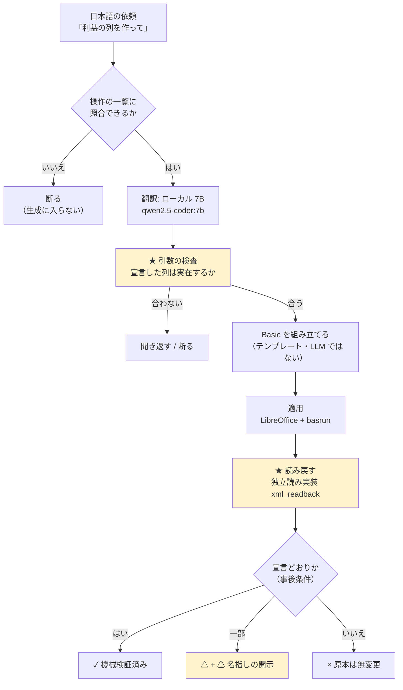

# ailine

自然言語の依頼を、ローカルの 7B モデルが LibreOffice Basic に翻訳し、`.xlsx` に適用し、
★ 適用したファイルを開き直して読み戻し、確かめられた時だけ `✓` を出す。

> この道具の値打ちは「できること」ではなく、「できたと言わないこと」にあります。（ゼロトラストによる）
> 自然言語→Excel の自動化そのものは、もう珍しくありません。
> 珍しいのは、確かめられなかった時に `✓` を出さないという拒否の規律のほうです。

```
✓  機械検証済み   適用後に読み戻して、宣言どおりだと確かめられた
△  一部だけ確認   確かめられた範囲と、確かめられなかった範囲を名指しで開示する
×  失敗           原本には触っていない（作業結果は隣に残す）
```

---

## ★ はじめに（期間についての開示）

この repo は課題の提示より前（2026-08-10）から個人で作っていたものです。
課題期間（8/26〜9/2）にやったのは、新機能の追加ではなく、検証と処置でした。

| | |
|---|---|
| repo 全体 | 2026-08-10 起点・200 commit 超 |
| 課題期間にやったこと | ① 外部の目による盲検レビュー 5 面 → 出た致命 10 件を全件処置 ② 表の基本操作（行の追加・削除／列の削除／1 セル書換） ③ 評価者が触れる GUI ④ 自分で GUI を触って出た欠陥 13 件の処置（8/31） |
| 課題期間にやらなかったこと | 新機能の拡張。単一ファイル（<!-- MAIN_FILE_LINES -->15515<!-- /MAIN_FILE_LINES --> 行）の分割は**着手済み** ── 44% を `ailine_core/` へ出し、判定の段は op ごとに割り終えました（理由と残りは「4. 判断・制約・学び」） |

土台が既存であることを踏まえて読んでいただくために、何を今週やったかは
`git log --since=2026-08-26 --oneline` で追える形にしてあります。

---

## 1. アイデア

### ひとことで

AI が書いた結果を、AI に検算させない Excel 自動化。
ローカル LLM を用いて閉域網でも動作する自然言語による Excel の作成。

翻訳は LLM がやり、検証は機械（決定的なコード）がやる。役割をはっきり分けています。

### 想定ユーザー

AI の出力を、検算せずに業務へ流せない人。
具体的には、中小企業・個人事業の事務や経理で、毎月同じ形の Excel を手で直している人。
この層は「たぶん合っています」を受け取れません。間違えた請求書は取り返しがつかないからです。
または外部にデータを持ち出せない環境での操作、自動化。
及び Excel を使いたいが操作を覚えきれない層。

### 解決したい課題

Excel の定型作業を自動化したい。でも既存の AI ツールには 2 つの壁があります。

1. 検算できない。出てきた表が正しいかは、結局人が全部見ることになる。
   それなら手でやったほうが早い、という判断になります。
2. 社外に出せない。売上・単価・取引先名は、外部 API に投げられないことが多い。

### 提供する価値

- `✓` の意味が 1 行で言える。
  `✓` は「あなたのファイルは今こうなっている」（適用後に読み戻して確かめた事実）。
  推測でも、モデルの自己申告でもありません。
- 確かめられない範囲は、`⚠` で名指しして `✓` を取り下げる（`△` に落とす）。
  「全部だめ」でも「全部よし」でもない、という言い方を機械が持っています。
- 外に 1 バイトも出ない。ollama（ローカル）と LibreOffice だけで完結します。API 費用 $0。
- 戻せる。既定で原本を直接書き換えますが、書く前に必ずバックアップを取り、
  `ailine undo` でバイト単位で戻せます（戻しすぎたら `ailine redo` で進めます）。

### 主な利用場面

- 月次の売上表に「原価を引いた利益の列」を足して、合計行を付ける
- 取引先マスタから単価を転記する（VLOOKUP 相当）
- 同じ形の月次ブックが並んだフォルダを 1 冊に縦積みする
- CSV を、0 落ち（先頭ゼロの品番が数値化される事故）を作らずに取り込む

### アイデアのきっかけとなった体験や観察

生成 AI に Excel の操作を書かせると、動きはするが合っているか分からないコードが出てきます。
確かめようとすると結局全部読むことになり、自動化した意味が消えます。

決め手になったのは、自分の実装で踏んだ事故のほうです。
検算のコードが、検算される対象と同じ関数を使っていたため、
「合っている」という判定が恒真になっていました。
外部の目に盲検で測らせたら、この形の欠陥が同じ期間に 4 件出ました。

> ここから設計が決まりました
> 検算は、対象と別の実装で、入力側から数え直す。
> 例: 適用後の検証は openpyxl ではなく、`src/ailine_core/xml_readback.py`（xlsx の XML を
> 直接読む独立実装）で読み戻します。同じライブラリの同じ読み方では、同じ嘘をつくからです。

### なぜ AI を使うのか

翻訳（人の言葉 → 操作の意図）は AI にしかできません。
「みかんの下に梨を追加して」の「下」がどの行かは、規則では書き切れません。

逆に、検証は AI にさせません。行数を数える・値を突き合わせる・列がずれていないか見るのは、
決定的なコードのほうが速くて正確で、しかも間違え方が予測できます。

この線引き自体が、この道具の設計の中心です。

### 実際に利用される可能性や、事業としての展開可能性

- すぐ使える形: ローカル完結・API 費用 $0・PC 1 台で動く。
  情シスの承認が要らないのは、社外にデータが出ないからです。
- 横に広がる形: 「適用して、読み戻して、確かめられた時だけ `✓`」という構造は
  Excel 固有ではありません。同じ形が、書類生成・データ移行・設定変更に載ります。
- 正直な現状: 今は PoC です。即座に販売可能な状態ではありません（既知の問題は「4.」に名指しで書きます）。

---

## 2. プロトタイプとデモ

### デモ

- デモ URL: ありません。ローカル実行が前提の設計（データを外に出さない）のため、
  ホスティングしていません。手元で `python gui/server.py` を打つと `http://127.0.0.1:8760/` が開きます。
- スクリーンショット: 下に 4 枚（実物を撮ったもの・加工していません）。ファイルは [docs/screenshots/](docs/screenshots/) にもあります。
- 動画: ありません（実演はその場で操作します・手順は [demo/手順.md](demo/手順.md)）。

① 書く前に、読みを見せる ── まだファイルは 1 バイトも変わっていません。


② `✓` 機械検証済み ── 適用後に開き直して確かめた結果。変わったセルを 1 つずつ挙げ、
「他は 1 セルも変わらず」まで言います。


③ `△` 確かめきれていないところがあります ── 同じ依頼を欠けのある表に出した回。
`⚠ 1 行は検証できていません（1 列目が空のため走査がそこで止まり、この行を見ていない）`
と名指しして、`✓` を取り下げます。


④ `？` 断り ── 一覧に無い依頼（画像の挿入）。生成に入りません。
「このまま実行」が押せなくなります。


★ ③ と ④ がこの道具の山場です。動くところではなく、`✓` を出さないところを見てください。

### 代表的な利用の流れ

```
① ファイルを選ぶ        GUI からエクスプローラで .xlsx を開く
        ↓               → 機械が読んだこと（シート名・見出し・行数）を先に表示する
② 日本語で頼む          「売上から原価を引いた利益の列を作って」
        ↓               → LLM の出力はここで止まり、解釈行として人に見える
③ 実行                  下書き（原本のコピー）に適用 → 読み戻して検証
        ↓
④ 判定を見る            ✓ / △ / × と、変わった箇所、⚠ の理由
        ↓
⑤ 原本に反映            納得したら反映（バックアップ + undo つき）
```

③ が下書きに対して行われるのが要点です。原本は、人が「反映」を押すまで変わりません。

### 実装範囲

#### 主な機能

`ailine ops` が出す一覧が正です（この表は登録簿から自動生成されるので、文書とずれません）。
**29 操作**が登録されています。

| 分類 | 操作 |
|---|---|
| 並べ替える | SORT |
| 計算する | COMPUTE_COLUMN / AGGREGATE / APPEND_TOTAL / PIVOT |
| 表を編集する | LOOKUP_FILL / MERGE / INSERT_ROWS / ADD_ROW / DELETE_ROWS / DELETE_COLUMN / SET_COLUMN_VALUE / SET_CELL_VALUE / SWAP / ADD_COLUMN / SET_WHERE / EXTRACT / EXTRACT_COLUMNS / SPLIT_CELL / DEDUP / REPORT_PER_ROW / FORMAT_MAP |
| 見た目を整える | BOLD / FILL_COLOR / NUMBER_FORMAT / CENTER_ALIGN / DRAW_BORDERS / AUTOFIT |
| グラフを作る | CHART |

（ADD_ROW / DELETE_ROWS / DELETE_COLUMN / SET_CELL_VALUE / SWAP / ADD_COLUMN / SET_WHERE / EXTRACT_COLUMNS の 8 つが、課題期間に足した表計算の基本操作です。）

一覧に無い依頼は、生成に入らず断ります。それらしいコードを作って見せません。
登録する操作は、実際に要る仕事から逆算して選んでいます。基本操作の組み合わせで書けるものは、あえて登録していません。必要になれば、基本操作を組み立てる形で足せるようにしてあります。

#### AI が担う役割

| 工程 | 担当 |
|---|---|
| 依頼文 → 操作と引数（DSL）への翻訳 | AI（ローカル 7B） |
| 引数が表の実体と合っているかの検査 | 機械（`verify_dsl_args`） |
| DSL → LibreOffice Basic の生成 | 機械（テンプレート・LLM ではない） |
| 適用 | LibreOffice（basrun 経由） |
| 適用後の読み戻しと判定 | 機械（独立読み実装） |

★ AI が触るのは最初の 1 工程だけです。生成される Basic は平文で残り、`git diff` で読めます。

#### 実装済み

- 上の 29 操作（翻訳 → 検査 → 生成 → 適用 → 読み戻し検証 → 差分表示）
- 原本への直接反映と `ailine undo` / `ailine redo`（世代つき・復元自体も可逆）
- フォルダ単位の処理（棚卸し / 縦積み / 条件抽出 / 検算の単独再実行）
- CSV の読み取り検疫（0 落ちを作らない）と CSV / PDF への書き出し（書いたものを読み戻して照合）
- 語彙外の依頼に対する「もしかして」提案と、独自の言い回しの登録
- GUI（前後の表・書式の反映・下書きと undo・複数ファイル・確認ダイアログ）

#### モックまたは手動処理

- GUI のファイル選択と保存は OS のダイアログ（tkinter）を呼びます。ブラウザ内で完結しません。
- グラフ・中央揃えなどの見た目は GUI の表では確認しきれません。
  「LibreOffice で開く」ボタンで実物を開いて確認する形にしています（見た目の判定は人がやる）。

#### 未実装

- 単一ファイルの分割の**続き** ── 判定の段（`verify_dsl_args`）は 26 の op ごとに
  割り終えました（1,735 → 227 行）。残るのは、それを `ailine_core/` へ
  移すこと。先に 27 個の共有ヘルパ（654 行）を出さないと循環します

（「なぜ今やらないか」は「4. 判断・制約・学び」に書きます。）

### 評価者が確認できる操作手順と期待結果

A. 依存を一切入れずに確かめられること（LibreOffice も ollama も不要）

```bash
pip install -r requirements-dev.txt
python -m pytest tests -q -m "not local"
```

期待: 全件緑（<!-- TOTAL_TESTS -->3153<!-- /TOTAL_TESTS --> 本のうち、実機が要る 28 本を除いた範囲）。
★ この 2 つの数は `tests/test_local_test_count.py` が実測と突き合わせています ──
文書の数字を、人の記憶で守らないためです。

B. 実機で確かめられること（LibreOffice + ollama が要る・「5. セットアップ」の後で）

| # | やること | 期待される結果 |
|---|---|---|
| 1 | GUI で `demo/2_売上.xlsx` を開く | 操作前の表が、書式つきで表示される |
| 2 | 「売上から原価を引いた利益の列を作って」→ 実行 | 解釈行（操作名と対象列）が出た後、`✓ 機械検証済み`。利益列が増える |
| 3 | 「みかんの下に梨を追加して」→ 実行 | みかんの次の行に梨が入る（末尾ではない） |
| 4 | 「梨の売上を 2000 にして」→ 実行 | 梨の行の売上だけが 2000 になる（列全体ではない） |
| 5 | 「原価の右に備考の列を追加して」→ 実行 | 原価と利益の間に空の備考列が入る。利益の式は壊れない |
| 6 | 「原価が 500 以上の項目のチェック列に「◎」を付けて」→ 実行 | 原価 700/900 の行だけに ◎ が付く。300 の行は空のまま |
| 7 | 「みかんとぶどうを入れ替えて」→ 実行 | 2 行が入れ替わる。利益の式は自分の行を指したまま（値を交換する実装だと、ここで各行の金額が他の行の値になる） |
| 8 | undo を押す | 1 つ前の状態にバイト単位で戻る |
| 9 | ★ `demo/3_売上_欠けあり.xlsx` で 2 を繰り返す | `✓` が出ない。「検証できていない行がある」と名指しで出て `△` に落ちる |
| 10 | ★ 一覧に無い依頼（例:「画像を挿入して」）を出す | 生成に入らない。「何をしますか」と聞き返し、`ailine ops`（頼める操作の一覧）へ誘導して終わる（終了コード 3）。コードは 1 行も書かれない |

★ 9 と 10 がこの道具の山場です。動くところではなく、`✓` を出さないところを見てください。

---

## 3. 技術構成

### 全体構成と処理の流れ



黄色が、この道具が普通と違うところです。入口で疑い、出口で数え直す機構になっています。

### 使用した AI・モデル

| 用途 | モデル | 置き場所 |
|---|---|---|
| 依頼文 → DSL の翻訳 | `qwen2.5-coder:7b`（既定・差し替え可） | ローカル（ollama） |
| 開発（実装の記述） | Claude Opus（Claude Code） | 開発時のみ・製品では使わない |

製品の実行時に外部 API は 1 つも呼びません。

### 使用したライブラリ・API・MCP・CLI など

| | |
|---|---|
| 実行時の依存 | `openpyxl` のみ（Python 3.10+） |
| 外部プロセス | LibreOffice（headless）、[basrun](https://github.com/namakoo-dev/basrun)（自作・MIT・別 repo）、ollama |
| GUI | **Python 標準ライブラリのみ**（`http.server` + 単一 HTML）。フレームワークなし |
| テスト | pytest |
| 開発ツール | Claude Code（「6. AI 開発ツールの利用」） |

★ GUI に依存を足さなかったのは、評価者の環境で `pip install` が 1 つ増えるたびに、
動かない可能性が増えるからです。`scripts/ci_parity.py` が、宣言していない依存の混入を止めています。

### 技術や構成を選んだ理由

| 選んだもの | なぜ |
|---|---|
| LibreOffice Basic 経由での適用 | openpyxl で書くと、条件付き書式・図形・ピボット・VBA が黙って消えます。Basic なら実アプリが開いて保存するので、触っていない要素が残ります |
| ローカル 7B | 想定ユーザーのデータは外に出せません。天井は低いですが、外した時に `✓` を出さない設計なので、精度が主張の中心にありません |
| DSL を挟む（依頼文 → DSL → Basic） | LLM に直接コードを書かせると、機械検証できません。DSL に落とせば、引数を実体と突き合わせられます（その列は実在するか、数値か） |
| 読み戻しに openpyxl を使わない | 書き手と読み手が同じライブラリだと、同じ勘違いをします。`xml_readback` は xlsx の XML を直接読む独立実装です |
| GUI は薄い殻 | `✓ / △ / ×` は `ailine run --json` の返り値をそのまま映すだけ。GUI が判定を導いたら、それは 2 つ目の実装で、今週潰してきた欠陥の新造になります |

### 設計・実装で工夫したこと

1. 判定には三項が要る（依頼 / 宣言 / 実体）。
   「宣言した列に書けたか」だけを見ると、依頼と宣言がずれていた時に恒真になります。
   3 つを別々に持ち、突き合わせています。

2. 分母は入力側から取る。
   「何行あるか」を出力から数えると、消えた行が分母からも消えて「欠落 0」になります。
   物理的な使用範囲（`data_extent`）から数え、走査で見た範囲との差は `⚠` に変えます。

3. `⚠` が 1 つでも立てば `✓` は出ない。
   これを各所の `if` で書くと必ず片方を書き忘れるので、1 つの関数
   （`count_suspicious_advisories`）に畳み、呼び出し側に判断を持たせていません。

4. 消えたものは差分に出ない。
   ゴールデンテストは「出るもの」しか守れません。テストが全部緑のまま致命が 3 件出たので、
   番人自身に変異試験（わざと壊して赤くなるか確かめる）を課しています。

5. 断れない時は開示する。
   事故と正当な操作が機械的に区別できない場面では、拒否も黙認もせず、
   何が確かめられなかったかを名指しで書き、`✓` を取り下げます。

### 安全性や権限制御で考慮したこと

| 危険 | 対処 |
|---|---|
| 原本を壊す | 既定で反映前にバックアップ。`ailine undo` で世代を遡れる。復元自体も可逆（戻す前の状態も退避する） |
| 書き換えの取りこぼし | 反映は原子的（一時ファイルを作って `os.replace`）。失敗したら原本は無変更。かつては失敗時に原本が 0 バイトになり「変更していません」と報告する経路がありました（盲検で発覚・処置済み） |
| 意図しない上書き | 既存データを持つ列に書く場合は、指定が無くても確認を挟む（対話なら y/N、非対話なら終了コード 7） |
| 飾りの消失 | LibreOffice 往復で失われる要素（条件付き書式・図形・ピボット・VBA）を検出したら、原本に触る前に申告して止まる |
| 同時実行 | `ailine run` は同時に 1 本だけ（別プロセスが動いていれば待たずに即エラー） |
| 情報の流出 | 外部 API を呼ばない。GUI は `127.0.0.1` にのみ bind する。CI でも外部接続を要さないことを確認している |
| 語彙外の操作 | 生成に入らない（それらしいコードを作って見せない） |

---

## 4. 判断・制約・学び

### 限られた時間で優先したこと

新機能ではなく、既に在るものの検証と処置に全部を使いました。
順番は「取り返しのつかなさ」で決めています。派手に落ちるものより、静かに壊れるものが先です。

1. 原本を壊す経路（データが消えるのに、消えていないと報告する）
2. 検算が恒真になっている経路（`✓` が意味を失う）
3. 評価者が触れる形（GUI）
4. 表計算の基本操作（行の追加・削除ができないと道具として成り立たない）

### 作らなかったことと、その理由

| 作らなかったもの | 理由 |
|---|---|
| 単一ファイルの分割（残り） | **番人を作ってから割りました。**`verify_dsl_args` の入出力 641 件を凍結し（`bench/verify_golden_probe.py`）、「1 件でも動いたら赤」を機械が見る状態にしてから op 分岐 26 個を切り出しています（1,735 → 227 行・出力は 1 件も変わっていません）。残るのは切り出した 26 関数を `ailine_core/` へ移すことで、先に 27 個の共有ヘルパ（654 行）を出さないと `ailine_core → ailine` の循環になります |
| 「〜以外」の抽出 | 「味噌汁以外を抜き出して」には比較『〜でない』が要ります。この述語は Python・Basic・凍結した真理値表の 3 箇所が独立に持つので、締切前に触ると 3 つの同期がずれます。無いものは名指しで断る方を選びました（黙って「味噌汁だけを抜き出す」に化けると、残したい行を失う） |
| 新しい操作の追加 | 未確認の致命を抱えたまま数を増やすと、確かめる対象が増えるだけです |
| 多 OS 対応の CI | Windows 前提（パス表現と LibreOffice の起動）。まず確実に緑になる 1 OS で始めました |

### うまくいかなかったこと

- 検証が恒真だった。検算のコードが、検算される対象と同じ関数を使っていました。
  盲検で指摘されるまで、テストは全部緑でした。
- 番人が「在るのに鳴らない」形が 4 件。ガードは書いてあるのに、本番の経路に配線されて
  いませんでした（本番は別の関数を通っていた）。在ることと効くことは別です。
- 同じ直しを片側だけに入れた。経路が 2 本ある所で片方だけ直す事故を、3 日で 3 回。
  処方を「両方直す」から「1 つの関数に畳んで、呼び出し側に持たせない」に変えました。
- 手元にあるから見えない依存。LibreOffice・Pillow・ollama が開発機にあるせいで、
  依存に宣言していないのに動いていました。CI で 4 回赤くなって気づき、`scripts/ci_parity.py`（宣言外の依存を遮断して
  素の環境で走らせる）を作りました。

### 自分で GUI を触って出た欠陥 13 件（2026-08-31）

テストが全部緑のまま、手で触ると 1 日で 13 件出ました。
うち 3 件は `✓` が出たまま違う操作をしていたもので、一番重い形です。

| # | 症状 | 何が抜けていたか |
|---|---|---|
| 1 | 入れ替えで式を直しているのに「直していません」と言う | 判定は正しく、説明の文面が古かった |
| 2 | 「A の単価と B の単価を入れ替えて」で行が丸ごと入れ替わり `✓` | 三項の「依頼」が抜け、宣言だけを検算していた |
| 3 | 単価だけ入れ替えると、直値の金額が取り残される | 派生列（金額＝件数×単価）を誰も見ていなかった |
| 4 | 2 の直しが「一段目が降りた回」に届かない | 片配線（同じ形の経路が 2 本あった） |
| 5 | 「8 行目に丸山工業の行」を 1 つの名前として飲み込む | 助詞を名前に含めていた |
| 6 | これから置く行を「表に無い」と断る | 存在チェックが追加にも掛かっていた |
| 7 | 行番号で指した入れ替えが聞き返しに落ちる | 追加・削除では直したのに、入れ替えに残っていた |
| 8 | 7 を直したら実行側が名前前提のまま別の行を動かした | 判定と実行で住所の解き方が違った |
| 9 | 「5 行目の」という限定が無視される | 行番号による絞り込みが抽出に無かった |
| 10 | 抽出が合計行まで持っていく | 合計行の除外が抽出に配線されていなかった |
| 11 | 機械が LLM の揺れを増幅していた | 『60000』という数を「行の名前」として解いていた |
| 12 | 入れ替えの依頼が 1 セル書換になり、データが 1 つ消えて `✓` | 三項の「依頼」が抜けた形（同じ日に 2 回目） |
| 13 | 合計行の見出しが列と一緒に動く理由が伝わらない | 判定は `⚠` を出していたが、心当たりを名指ししていなかった |

> 11 がこの日の一番の収穫です。「LLM の揺れが厄介だ」と思っていた事象を追いかけたら、
> 半分は機械側の責任でした。揺れは消せませんが、増幅は消せます。

### 測って選んだこと（2026-08-29）

同じ形の失敗（頼んでいない範囲に書く）が 2 日続いたので、
「モデルが弱いのでは」を疑いのまま置かず、順に測りました。

①モデルを比べた（同じ凍結検体 52 件・同じ本番プロンプト）

| | qwen2.5-coder:7b | gemma4:e4b-it-qat | qwen3:8b |
|---|---|---|---|
| op 分類 | 94.2% | 94.2% | **98.1%** |
| 曖昧への誤断定 | **0/10** | 1/10 | **0/10** |

②一番強いモデルでも、問題の 3 件は 0/3 でした（しかも 1 回 11〜13 秒＝4 倍遅い）。
外し方が違うだけで、どのモデルも「1 セルに書くだけ」の依頼を列全体の書き換えや
行の挿入に読み替えます。

③表の中身を見せても 0/3。一段目に渡していたのは見出しだけだったので、
行番号つきで中身を足して測りました。改善しませんでした。

④質問を変えたら 3/3。同じモデル・同じ 3 秒で、「どの操作か？」ではなく
「どのセルか？」と聞いた結果です。

> 「丸山重工の項目を PC パーツにして」
> 　操作を聞く → `SET_COLUMN_VALUE` 3/3（列を全部潰す）
> 　座標を聞く → `(8, 2)` 3/3（正解）

結論: 詰まっていたのはモデルの能力ではなく、問いの立て方でした。
「範囲」は実表を見ないと決まらないので、機械が決めます。
LLM に聞く場合も座標で聞き、返事を実表で検算します。当初は LLM に自然言語からセル位置や操作を判断させるように設計していましたが、
言語特有の曖昧さに対し 7B サイズのモデルでは操作者の正確な意図を推定すること、適切な位置の指定は困難でした。
そこで設計を切り替え、原本の読み込み時にセルマップを生成し座標位置と代入されている値をマップとして保持させています。
これにより位置や操作の特定は LLM にとって座標での操作に置き換わります。

⑤より小さいモデルでも動きます。
`qwen2.5-coder:1.5b` / `gemma3:1b` でも基本操作の 85% 前後が通りました。
落ちた分は表記ゆれによるもので、道具の側の限界ではありません。
★ この測定の副産物として、3 日間見つからなかった設計の穴が 1B モデルによって 6 件露出しました。
小型モデルは「弱いから落ちる」のではなく、機械が暗黙に補っていた所を踏み抜きます。
小型モデルは、設計の穴を見つける道具になります。

この線に沿って、位置・列・値の決定を機械側へ寄せました。効果で測る検体
（表 7 種 × 基本操作 29 種 × 言い回しの揺れ = <!-- MATRIX_CASES -->245<!-- /MATRIX_CASES --> 件・op 名でなく
出来上がったファイルで判定）で、86.9% → 94.0% → <!-- MATRIX -->236/245 = 96.3%<!-- /MATRIX -->
（断り <!-- MATRIX_REFUSED -->7<!-- /MATRIX_REFUSED -->・失敗 2・**壊していない 99.1%**）です。失敗 2 件は落とさずに分母に残しています（比較語の無い条件の指し方が、条件つき書換に届かない ── 下の「未解決」）。

検体は 84 → 93 → 160 → 190 → **<!-- MATRIX_CASES -->245<!-- /MATRIX_CASES --> 件**と増やしてきました。増やすたびに、それまで
**測れていなかった穴**が出ます。

- 中身が重複する表（同じ取引先が 2 行）では**行番号でしか指せない**ので、
  「3 行目の下に」という言い方を足しました。足した直後はその 9 件のうち 7 件が落ちました。
- ★ 2026-09-02 に気づいたこと: **計算列も入れ替えも 1 件も測れていませんでした。**
  8/31 に見つけた欠陥 13 件のうち**5 件が入れ替え**だったのに、分母に無かった。
  理由は表の側にありました ── どの表も数値の列が 1 本しかなく、2 列の演算を頼めなかった
  （**器の形が、測れるものを決めていた**）。数値 2 本の表と式のある表を足したところ、
  その場で 3 件出ました。

★ **数字は下がる方向にも動きます。それが検体の仕事です。**

★ この過程で測定器そのものが汚れた回があります。測定を裏で走らせたまま手元でも
実行してしまい、排他ロックの奪い合いで正解率が 35.7% と出ました。
数字が動いたら、まず測定器を疑う。走らせ直したうえで数字を採っています。

### 現在の制約や既知の問題

PoC です。業務での本番利用はできません。

- `.ods` は扱えません（`ailine run` が触る前に断り、.xlsx への変換を案内します）
- `ailine stop` が、自分が漏らした LibreOffice プロセスを見つけられない場合がある
- PDF 照合で、折り返した行を取りこぼす（`xfail strict` で印を残してあります）
- 珍しい UNO 操作は当たり率が落ちる（Basic + UNO は学習データが薄い）
- 人が同じファイルを開いたまま実行した場合: Excel / LibreOffice のロックファイル（`~$名前` / `.~lock.名前#`）を見て書く前に止めます（2026-08-30 実測で追加）。ただしロックを作らない開き方（閲覧専用アプリ等）は検出できません
- 翻訳の精度: 凍結した検体で op 一致 <!-- BATTERY_OP -->49/52 = 94.2%<!-- /BATTERY_OP -->、引数一致 68/69 = 98.6%、曖昧な依頼への誤断定 0/10（`bench/`・2026-08-29 実測・同じ結果が 2 回）。
  ただしこれは凍結した検体上の数字であって、未知の依頼文に対する保証ではありません

### 開発を通して分かったこと

- テストが緑であることは、正しさの保証ではありません。
  外の目に盲検で測らせたら、緑のまま致命が出ました。自分で書いたテストは、
  自分が想像できた壊れ方しか見ていません。
- 「出ないこと」は信号ではありません。検算が走らなかった場合と、走って合格した場合が
  画面上で同じに見えるなら、それは合格ではありません。
- 数字は機械で守る。「テストは 1 本」と README に書いてから、実際が 14 本になるまで
  誰も気づきませんでした（この README を書くときに直しました）。
- 一般解は存在して、無価値なことがある。検出の網を広げると、通ってはいけないものまで
  一緒に通ります。増やす前に、二口目で判定する。

### 今後改善したいこと

1. 分割の続き ── 切り出した 26 関数を `ailine_core/` へ（本体 15,456 行・すでに 44% が `ailine_core/` の 46 モジュールへ出ています）
2. 未知の依頼文に対する翻訳精度の測定（今は凍結検体上の数字しかありません）

---

## 5. セットアップ

### 必要な環境

| | |
|---|---|
| OS | **Windows**（パス表現と LibreOffice の起動が Windows 前提。他 OS は未検証） |
| Python | 3.10 以上 |
| LibreOffice | Calc が動くもの |
| [ollama](https://ollama.com/) | ＋ `qwen2.5-coder:7b`（`ollama pull qwen2.5-coder:7b`） |

★ テストだけ回すなら、LibreOffice / ollama / basrun は要りません。

### インストール

評価には clone を勧めます（GUI とデモ用ファイルは wheel に入らないため）。

```bash
# 1) 本体
git clone https://github.com/namakoo-dev/ailine
cd ailine
pip install -e .

# 2) 文書に適用する土台（別 repo・MIT）
git clone https://github.com/namakoo-dev/basrun ../basrun
```

CLI だけ使う場合は、タグを固定して入れることもできます（GUI とデモ検体は付きません）:

```bash
uv tool install git+https://github.com/namakoo-dev/ailine@v0.2.1
#   uv が無ければ: pipx install git+https://github.com/namakoo-dev/ailine@v0.2.1
```

### 環境変数

| 変数 | 意味 |
|---|---|
| `BASRUN` | `basrun.py` の場所。例: `setx BASRUN "%CD%\..\basrun\basrun.py"` |

他の設定（モデル名・温度・タイムアウト）は、すべてコマンドラインの引数で渡せます。

### 起動

**まずこれを打つ**

```bash
ailine doctor
```

python / openpyxl / ollama / モデル / LibreOffice / basrun / demo の在否を、**一度に名指しで**出します。
足りないものがあれば、落ちるコマンドを勧めずに、何が無いかと直し方を先に言います。

GUI を使う場合:

```bash
python gui/server.py       # http://127.0.0.1:8760/ が開く
```

### 動作確認

```bash
# ① 依存なしで（LibreOffice も ollama も要らない）
pip install -r requirements-dev.txt
python -m pytest tests -q -m "not local"

# ② 実機で
ailine demo                       # サンプルを今いる場所に置く
ailine run sample.xlsx "売上から原価を引いた利益の列を作って"
```

② の期待: 解釈行が出た後、`✓` と変更点の一覧。`ailine undo` で 1 つ前に戻せます。

---

## 6. AI 開発ツールの利用

### 利用した AI 開発ツール

**Claude Code**（Claude Opus）。実装のほぼ全部を書かせています。

### AI に任せたこと

- 実装そのもの（Python / LibreOffice Basic / HTML / テスト）
- 大規模な機械的作業（新しい操作を 8 つのテーブルに登録して回る、など）
- 外部の目としての盲検レビュー ── 期待値も過去の点数も直した箇所も渡さず、
  独立したエージェントに repo を測らせました。5 面回して、致命 10 件が出ました。

### 自分で判断したこと

- 何を作らないか。課題期間は新機能をゼロにする、と決めたのは自分です。
- 順番。「取り返しのつかない順」に並べました。
- `✓` の意味。「依頼どおり」ではなく「今こうなっている」に限定する、という
  意味の切り詰めは設計判断です。
- 拒否の線。一覧に無い操作は生成に入らない、という規律を入れるかどうか。

### 自分で検証・修正したこと

- GUI を実際に触って壊しました。「梨を追加して」の後に「梨の売上を 2000 に」と頼むと
  梨の行ごと消える、同じ操作を繰り返すと梨が増え続ける。
  これらは全部、手で触って見つけたものです。テストは緑のままでした。
- 下書きの意味を 3 回変えました。「積み上げる」「原本からやり直す」「積み上げ+undo」。
  実際に触って初めて、どれが自然かが分かりました。
- 番人に変異試験を課しました。わざと壊して赤くなることを確かめない番人は、
  「在るのに鳴らない」形で残ります。

### AI の提案を採用しなかった例と理由

1. 「`.ods` の拒否を、全形式に広げよう」
   → 却下。断る範囲を広げると、命綱（undo・バックアップ）に届く前に止まる経路ができます。
   盲検で出た所見でしたが、実測して確かめた上で採りませんでした。

2. 「表の操作を一意に指定する言語を設計する（見積もり 1 週間）」
   → 却下。実験（`bench/basic_by_name_spike.py`）で、LibreOffice Basic 側が名前から
   位置を解決できることが分かり、Python 側の役割は「名前が実在するかの関所」と
   「独立した事後条件」の 2 つに絞れました。1 週間の見積もりが、実験 1 本で消えました。

3. 「行の入れ替えは、値を交換すれば良い」
   → 却下。実測すると数式が壊れます（各行の合計が、別の行の値になる）。
   並びは正しく見えるので人の目では気づけません。`insertByIndex` + `moveRange`
   （LibreOffice 自身が参照を付け替える）で実装し、事後条件は式の文字ではなく
   計算結果で突き合わせています。

---

## 7. 補足

- **なぜこの形か（選ばなかった道と、その理由）**: [docs/なぜこの形か.md](docs/なぜこの形か.md)
  （なぜ CSV/DB でないのか・射程の境界・機械検証が持っている情報と持っていないもの）
- 技術詳細・全コマンド・設計判断の記録: [docs/ENGINEERING.md](docs/ENGINEERING.md)
  （この README の前身。全 29 操作の使い方、終了コード表、参照ライブラリ、限界の一覧）
- 土台となる別 repo: [basrun](https://github.com/namakoo-dev/basrun)（MIT・自作）
- ライセンス: MIT

> 最後に 1 行。
> この道具が一番仕事をしているのは、`✓` を出さなかった回です。
