# 依存関係（自動生成）

★ **この図は `scripts/deps_graph.py` が実体から生成する。手で書き換えない。**
  `tests/test_dependency_graph_is_current.py` が図と実体の一致を守っている。

- モジュール **51** / import の辺 **73**
- 層の向きの違反（`ailine_core` → `ailine`）: **0 件**（core は本体を知らない ＝ 本体だけを差し替えられる）
- 被依存が多い順: `ailine_core`(12) / `primitives`(12) / `filetypes`(5) / `book_view`(4) / `postconditions._shared`(4)

★★ **この図に出ないもの**（読む人が「全部見えている」と誤解しないため）:

- **辞書や getattr 経由の呼び出し**。`POSTCONDITIONS` 辞書で op → 事後条件を
  引くので、事後条件 28 本は「本体から呼ばれていない」ように見える（実際は毎回呼ばれる）
- Basic 側（`helpers/*.bas`）への依存
- ★ **「辺が無い＝影響が無い」ではない。「import では繋がっていない」まで。**

```mermaid
graph LR
  subgraph G0[本体]
    ailine[ailine]
  end
  subgraph G1[ailine_core（部品）]
    ailine_core[ailine_core<br/>被依存 12]
    ailine_core_alias_store[alias_store]
    ailine_core_ask_choice[ask_choice]
    ailine_core_attributes[attributes]
    ailine_core_book_view[book_view]
    ailine_core_cellmap[cellmap]
    ailine_core_chart_check[chart_check]
    ailine_core_chart_range[chart_range]
    ailine_core_claim[claim]
    ailine_core_cli_render[cli_render]
    ailine_core_column_type[column_type]
    ailine_core_compare_blocked[compare_blocked]
    ailine_core_csv_export[csv_export]
    ailine_core_csv_quarantine[csv_quarantine]
    ailine_core_date_compare[date_compare]
    ailine_core_dsl_step[dsl_step]
    ailine_core_examples[examples]
    ailine_core_extract_multi[extract_multi]
    ailine_core_filetypes[filetypes<br/>被依存 5]
    ailine_core_formula_health[formula_health]
    ailine_core_inspection[inspection]
    ailine_core_interpretation[interpretation]
    ailine_core_local_only[local_only]
    ailine_core_match[match]
    ailine_core_multifile[multifile]
    ailine_core_op_axes[op_axes]
    ailine_core_pdf_export[pdf_export]
    ailine_core_primitives[primitives<br/>被依存 12]
    ailine_core_projection[projection]
    ailine_core_report_group[report_group]
    ailine_core_report_per_row[report_per_row]
    ailine_core_residue[residue]
    ailine_core_row_identity[row_identity]
    ailine_core_split_cell[split_cell]
    ailine_core_stack[stack]
    ailine_core_stage_organs[stage_organs]
    ailine_core_subject[subject]
    ailine_core_suggest[suggest]
    ailine_core_sum_identity[sum_identity]
    ailine_core_table_scan[table_scan]
    ailine_core_target_sheet[target_sheet]
    ailine_core_total_row[total_row]
    ailine_core_verify[verify]
    ailine_core_write_precondition[write_precondition]
    ailine_core_xml_readback[xml_readback]
  end
  subgraph G2[事後条件（op ごと）]
    ailine_core_postconditions[postconditions]
    ailine_core_postconditions__shared[postconditions._shared]
    ailine_core_postconditions_derive[postconditions.derive]
    ailine_core_postconditions_move[postconditions.move]
    ailine_core_postconditions_shape[postconditions.shape]
  end
  ailine --> ailine_core
  ailine --> ailine_core_ask_choice
  ailine --> ailine_core_book_view
  ailine --> ailine_core_chart_check
  ailine --> ailine_core_chart_range
  ailine --> ailine_core_claim
  ailine --> ailine_core_cli_render
  ailine --> ailine_core_column_type
  ailine --> ailine_core_date_compare
  ailine --> ailine_core_dsl_step
  ailine --> ailine_core_examples
  ailine --> ailine_core_filetypes
  ailine --> ailine_core_formula_health
  ailine --> ailine_core_interpretation
  ailine --> ailine_core_multifile
  ailine --> ailine_core_op_axes
  ailine --> ailine_core_postconditions__shared
  ailine --> ailine_core_postconditions_derive
  ailine --> ailine_core_postconditions_move
  ailine --> ailine_core_postconditions_shape
  ailine --> ailine_core_primitives
  ailine --> ailine_core_report_per_row
  ailine --> ailine_core_subject
  ailine --> ailine_core_sum_identity
  ailine --> ailine_core_table_scan
  ailine --> ailine_core_target_sheet
  ailine --> ailine_core_write_precondition
  ailine --> ailine_core_xml_readback
  ailine_core_chart_range --> ailine_core
  ailine_core_chart_range --> ailine_core_primitives
  ailine_core_column_type --> ailine_core_primitives
  ailine_core_csv_export --> ailine_core
  ailine_core_csv_quarantine --> ailine_core
  ailine_core_dsl_step --> ailine_core_claim
  ailine_core_dsl_step --> ailine_core_projection
  ailine_core_dsl_step --> ailine_core_subject
  ailine_core_extract_multi --> ailine_core
  ailine_core_extract_multi --> ailine_core_filetypes
  ailine_core_extract_multi --> ailine_core_primitives
  ailine_core_formula_health --> ailine_core_xml_readback
  ailine_core_inspection --> ailine_core_primitives
  ailine_core_match --> ailine_core
  ailine_core_multifile --> ailine_core_filetypes
  ailine_core_multifile --> ailine_core_primitives
  ailine_core_multifile --> ailine_core_total_row
  ailine_core_postconditions__shared --> ailine_core
  ailine_core_postconditions__shared --> ailine_core_date_compare
  ailine_core_postconditions__shared --> ailine_core_primitives
  ailine_core_postconditions_derive --> ailine_core
  ailine_core_postconditions_derive --> ailine_core_book_view
  ailine_core_postconditions_derive --> ailine_core_postconditions__shared
  ailine_core_postconditions_derive --> ailine_core_primitives
  ailine_core_postconditions_derive --> ailine_core_report_per_row
  ailine_core_postconditions_derive --> ailine_core_table_scan
  ailine_core_postconditions_move --> ailine_core
  ailine_core_postconditions_move --> ailine_core_book_view
  ailine_core_postconditions_move --> ailine_core_postconditions__shared
  ailine_core_postconditions_move --> ailine_core_primitives
  ailine_core_postconditions_move --> ailine_core_sum_identity
  ailine_core_postconditions_move --> ailine_core_table_scan
  ailine_core_postconditions_shape --> ailine_core_book_view
  ailine_core_postconditions_shape --> ailine_core_postconditions__shared
  ailine_core_postconditions_shape --> ailine_core_primitives
  ailine_core_postconditions_shape --> ailine_core_table_scan
  ailine_core_report_per_row --> ailine_core
  ailine_core_report_per_row --> ailine_core_csv_quarantine
  ailine_core_stack --> ailine_core
  ailine_core_stack --> ailine_core_filetypes
  ailine_core_suggest --> ailine_core_alias_store
  ailine_core_total_row --> ailine_core_primitives
  ailine_core_verify --> ailine_core
  ailine_core_verify --> ailine_core_filetypes
  ailine_core_verify --> ailine_core_primitives
```

