# 依存関係（自動生成）

★ **この図は `scripts/deps_graph.py` が実体から生成する。手で書き換えない。**
  `tests/test_dependency_graph_is_current.py` が図と実体の一致を守っている。

- モジュール **89** / import の辺 **242**
- 層の向きの違反（`ailine_core` → `ailine`）: **0 件**（core は本体を知らない ＝ 本体だけを差し替えられる）
- 被依存が多い順: `ailine_core`(25) / `primitives`(17) / `xml_readback`(11) / `filetypes`(9) / `total_row`(9)

★★ **この図に出ないもの**（読む人が「全部見えている」と誤解しないため）:

- **辞書や getattr 経由の呼び出し**。`POSTCONDITIONS` 辞書で op → 事後条件を
  引くので、事後条件 28 本は「本体から呼ばれていない」ように見える（実際は毎回呼ばれる）
- Basic 側（`helpers/*.bas`）への依存
- ★ **「辺が無い＝影響が無い」ではない。「import では繋がっていない」まで。**

★★ 2026-09-16: ここに挙げた 2 つ（辞書経由・Basic 側）に**バグが 3 件住んでいた**。
  『見えない』と断って済ませるのをやめ、**下に層②・層③として描いた**。
  それでもなお出ないもの: 実行時の条件分岐（どの経路を通るかは依頼文で変わる）と、
  Basic の腕どうしの呼び出し関係。

```mermaid
graph LR
  subgraph G0[本体]
    ailine[ailine]
  end
  subgraph G1[ailine_core（部品）]
    ailine_core[ailine_core<br/>被依存 25]
    ailine_core_accounts_apply[accounts_apply]
    ailine_core_accounts_core[accounts_core<br/>被依存 5]
    ailine_core_accounts_read[accounts_read]
    ailine_core_alias_store[alias_store]
    ailine_core_anchor[anchor]
    ailine_core_argcheck[argcheck]
    ailine_core_arith[arith]
    ailine_core_ask_choice[ask_choice]
    ailine_core_attributes[attributes]
    ailine_core_book_view[book_view<br/>被依存 8]
    ailine_core_cellmap[cellmap]
    ailine_core_chart_check[chart_check]
    ailine_core_chart_range[chart_range]
    ailine_core_claim[claim]
    ailine_core_cli_render[cli_render]
    ailine_core_codegen[codegen]
    ailine_core_colors[colors]
    ailine_core_column_type[column_type]
    ailine_core_compare_blocked[compare_blocked]
    ailine_core_compare_codes[compare_codes]
    ailine_core_compare_words[compare_words]
    ailine_core_csv_export[csv_export]
    ailine_core_csv_quarantine[csv_quarantine]
    ailine_core_date_compare[date_compare]
    ailine_core_dedup_key[dedup_key]
    ailine_core_drop_redundant_delete[drop_redundant_delete]
    ailine_core_dsl_step[dsl_step]
    ailine_core_examples[examples]
    ailine_core_extract_multi[extract_multi]
    ailine_core_field_record[field_record<br/>被依存 5]
    ailine_core_filetypes[filetypes<br/>被依存 9]
    ailine_core_fold_insert_add[fold_insert_add]
    ailine_core_form_grid[form_grid]
    ailine_core_form_read[form_read<br/>被依存 5]
    ailine_core_forms_collect[forms_collect]
    ailine_core_forms_suspect[forms_suspect]
    ailine_core_formula_health[formula_health]
    ailine_core_header_cell[header_cell]
    ailine_core_helper_interface[helper_interface]
    ailine_core_input_path[input_path<br/>被依存 5]
    ailine_core_inspection[inspection<br/>被依存 5]
    ailine_core_intent[intent]
    ailine_core_interpretation[interpretation]
    ailine_core_local_only[local_only]
    ailine_core_match[match]
    ailine_core_multifile[multifile]
    ailine_core_negation[negation]
    ailine_core_new_sheet[new_sheet]
    ailine_core_op_axes[op_axes]
    ailine_core_pdf_export[pdf_export]
    ailine_core_pdf_grid[pdf_grid]
    ailine_core_primitives[primitives<br/>被依存 17]
    ailine_core_projection[projection]
    ailine_core_prompt_window[prompt_window]
    ailine_core_quotes[quotes]
    ailine_core_report_group[report_group]
    ailine_core_report_per_row[report_per_row]
    ailine_core_required_word[required_word]
    ailine_core_residue[residue]
    ailine_core_route[route]
    ailine_core_row_conflict[row_conflict]
    ailine_core_row_identity[row_identity]
    ailine_core_row_placement[row_placement]
    ailine_core_row_words[row_words]
    ailine_core_split_cell[split_cell]
    ailine_core_split_people[split_people]
    ailine_core_stack[stack<br/>被依存 6]
    ailine_core_stage_organs[stage_organs]
    ailine_core_subject[subject]
    ailine_core_suggest[suggest]
    ailine_core_sum_identity[sum_identity]
    ailine_core_table_scan[table_scan<br/>被依存 6]
    ailine_core_target_sheet[target_sheet]
    ailine_core_threshold[threshold]
    ailine_core_total_row[total_row<br/>被依存 9]
    ailine_core_verify[verify]
    ailine_core_verify_accounts[verify_accounts]
    ailine_core_verify_forms[verify_forms]
    ailine_core_verify_split[verify_split]
    ailine_core_word_boundary[word_boundary]
    ailine_core_write_precondition[write_precondition]
    ailine_core_xml_readback[xml_readback<br/>被依存 11]
  end
  subgraph G2[事後条件（op ごと）]
    ailine_core_postconditions[postconditions]
    ailine_core_postconditions__shared[postconditions._shared]
    ailine_core_postconditions_derive[postconditions.derive]
    ailine_core_postconditions_move[postconditions.move]
    ailine_core_postconditions_shape[postconditions.shape]
  end
  ailine --> ailine_core
  ailine --> ailine_core_accounts_apply
  ailine --> ailine_core_accounts_core
  ailine --> ailine_core_accounts_read
  ailine --> ailine_core_alias_store
  ailine --> ailine_core_anchor
  ailine --> ailine_core_argcheck
  ailine --> ailine_core_arith
  ailine --> ailine_core_ask_choice
  ailine --> ailine_core_attributes
  ailine --> ailine_core_book_view
  ailine --> ailine_core_cellmap
  ailine --> ailine_core_chart_check
  ailine --> ailine_core_chart_range
  ailine --> ailine_core_claim
  ailine --> ailine_core_cli_render
  ailine --> ailine_core_codegen
  ailine --> ailine_core_column_type
  ailine --> ailine_core_compare_blocked
  ailine --> ailine_core_compare_codes
  ailine --> ailine_core_compare_words
  ailine --> ailine_core_csv_export
  ailine --> ailine_core_csv_quarantine
  ailine --> ailine_core_date_compare
  ailine --> ailine_core_drop_redundant_delete
  ailine --> ailine_core_dsl_step
  ailine --> ailine_core_examples
  ailine --> ailine_core_extract_multi
  ailine --> ailine_core_filetypes
  ailine --> ailine_core_fold_insert_add
  ailine --> ailine_core_form_read
  ailine --> ailine_core_forms_collect
  ailine --> ailine_core_formula_health
  ailine --> ailine_core_header_cell
  ailine --> ailine_core_helper_interface
  ailine --> ailine_core_input_path
  ailine --> ailine_core_inspection
  ailine --> ailine_core_intent
  ailine --> ailine_core_interpretation
  ailine --> ailine_core_local_only
  ailine --> ailine_core_match
  ailine --> ailine_core_multifile
  ailine --> ailine_core_negation
  ailine --> ailine_core_new_sheet
  ailine --> ailine_core_op_axes
  ailine --> ailine_core_pdf_export
  ailine --> ailine_core_pdf_grid
  ailine --> ailine_core_postconditions__shared
  ailine --> ailine_core_postconditions_derive
  ailine --> ailine_core_postconditions_move
  ailine --> ailine_core_postconditions_shape
  ailine --> ailine_core_primitives
  ailine --> ailine_core_prompt_window
  ailine --> ailine_core_quotes
  ailine --> ailine_core_report_group
  ailine --> ailine_core_report_per_row
  ailine --> ailine_core_required_word
  ailine --> ailine_core_residue
  ailine --> ailine_core_row_conflict
  ailine --> ailine_core_row_identity
  ailine --> ailine_core_row_placement
  ailine --> ailine_core_row_words
  ailine --> ailine_core_split_cell
  ailine --> ailine_core_split_people
  ailine --> ailine_core_stack
  ailine --> ailine_core_subject
  ailine --> ailine_core_suggest
  ailine --> ailine_core_sum_identity
  ailine --> ailine_core_table_scan
  ailine --> ailine_core_target_sheet
  ailine --> ailine_core_threshold
  ailine --> ailine_core_total_row
  ailine --> ailine_core_verify
  ailine --> ailine_core_verify_accounts
  ailine --> ailine_core_verify_split
  ailine --> ailine_core_write_precondition
  ailine --> ailine_core_xml_readback
  ailine_core_accounts_apply --> ailine_core
  ailine_core_accounts_apply --> ailine_core_accounts_core
  ailine_core_accounts_apply --> ailine_core_filetypes
  ailine_core_accounts_core --> ailine_core
  ailine_core_accounts_core --> ailine_core_field_record
  ailine_core_accounts_core --> ailine_core_form_read
  ailine_core_accounts_core --> ailine_core_match
  ailine_core_accounts_core --> ailine_core_split_people
  ailine_core_accounts_read --> ailine_core
  ailine_core_accounts_read --> ailine_core_accounts_core
  ailine_core_accounts_read --> ailine_core_csv_quarantine
  ailine_core_accounts_read --> ailine_core_filetypes
  ailine_core_accounts_read --> ailine_core_input_path
  ailine_core_alias_store --> ailine_core_word_boundary
  ailine_core_anchor --> ailine_core_book_view
  ailine_core_anchor --> ailine_core_quotes
  ailine_core_anchor --> ailine_core_row_words
  ailine_core_anchor --> ailine_core_table_scan
  ailine_core_argcheck --> ailine_core
  ailine_core_argcheck --> ailine_core_anchor
  ailine_core_argcheck --> ailine_core_book_view
  ailine_core_argcheck --> ailine_core_cellmap
  ailine_core_argcheck --> ailine_core_column_type
  ailine_core_argcheck --> ailine_core_dedup_key
  ailine_core_argcheck --> ailine_core_inspection
  ailine_core_argcheck --> ailine_core_intent
  ailine_core_argcheck --> ailine_core_quotes
  ailine_core_argcheck --> ailine_core_report_group
  ailine_core_argcheck --> ailine_core_report_per_row
  ailine_core_argcheck --> ailine_core_split_cell
  ailine_core_argcheck --> ailine_core_subject
  ailine_core_argcheck --> ailine_core_table_scan
  ailine_core_argcheck --> ailine_core_threshold
  ailine_core_argcheck --> ailine_core_total_row
  ailine_core_argcheck --> ailine_core_word_boundary
  ailine_core_chart_range --> ailine_core
  ailine_core_chart_range --> ailine_core_primitives
  ailine_core_chart_range --> ailine_core_total_row
  ailine_core_cli_render --> ailine_core
  ailine_core_cli_render --> ailine_core_field_record
  ailine_core_cli_render --> ailine_core_route
  ailine_core_codegen --> ailine_core_chart_range
  ailine_core_codegen --> ailine_core_colors
  ailine_core_codegen --> ailine_core_compare_codes
  ailine_core_codegen --> ailine_core_primitives
  ailine_core_codegen --> ailine_core_row_words
  ailine_core_codegen --> ailine_core_target_sheet
  ailine_core_column_type --> ailine_core_primitives
  ailine_core_compare_words --> ailine_core_threshold
  ailine_core_csv_export --> ailine_core
  ailine_core_csv_export --> ailine_core_xml_readback
  ailine_core_csv_quarantine --> ailine_core
  ailine_core_csv_quarantine --> ailine_core_xml_readback
  ailine_core_dsl_step --> ailine_core_claim
  ailine_core_dsl_step --> ailine_core_projection
  ailine_core_dsl_step --> ailine_core_subject
  ailine_core_extract_multi --> ailine_core
  ailine_core_extract_multi --> ailine_core_compare_blocked
  ailine_core_extract_multi --> ailine_core_filetypes
  ailine_core_extract_multi --> ailine_core_input_path
  ailine_core_extract_multi --> ailine_core_inspection
  ailine_core_extract_multi --> ailine_core_multifile
  ailine_core_extract_multi --> ailine_core_primitives
  ailine_core_extract_multi --> ailine_core_total_row
  ailine_core_extract_multi --> ailine_core_xml_readback
  ailine_core_form_read --> ailine_core
  ailine_core_form_read --> ailine_core_date_compare
  ailine_core_form_read --> ailine_core_field_record
  ailine_core_form_read --> ailine_core_form_grid
  ailine_core_form_read --> ailine_core_pdf_grid
  ailine_core_form_read --> ailine_core_primitives
  ailine_core_forms_collect --> ailine_core
  ailine_core_forms_collect --> ailine_core_field_record
  ailine_core_forms_collect --> ailine_core_form_read
  ailine_core_forms_collect --> ailine_core_forms_suspect
  ailine_core_formula_health --> ailine_core_xml_readback
  ailine_core_inspection --> ailine_core_primitives
  ailine_core_match --> ailine_core
  ailine_core_match --> ailine_core_inspection
  ailine_core_match --> ailine_core_stack
  ailine_core_multifile --> ailine_core
  ailine_core_multifile --> ailine_core_filetypes
  ailine_core_multifile --> ailine_core_input_path
  ailine_core_multifile --> ailine_core_primitives
  ailine_core_multifile --> ailine_core_total_row
  ailine_core_new_sheet --> ailine_core_book_view
  ailine_core_pdf_grid --> ailine_core_form_grid
  ailine_core_postconditions__shared --> ailine_core
  ailine_core_postconditions__shared --> ailine_core_colors
  ailine_core_postconditions__shared --> ailine_core_compare_blocked
  ailine_core_postconditions__shared --> ailine_core_date_compare
  ailine_core_postconditions__shared --> ailine_core_primitives
  ailine_core_postconditions_derive --> ailine_core
  ailine_core_postconditions_derive --> ailine_core_book_view
  ailine_core_postconditions_derive --> ailine_core_compare_blocked
  ailine_core_postconditions_derive --> ailine_core_postconditions__shared
  ailine_core_postconditions_derive --> ailine_core_primitives
  ailine_core_postconditions_derive --> ailine_core_report_group
  ailine_core_postconditions_derive --> ailine_core_report_per_row
  ailine_core_postconditions_derive --> ailine_core_table_scan
  ailine_core_postconditions_derive --> ailine_core_total_row
  ailine_core_postconditions_move --> ailine_core
  ailine_core_postconditions_move --> ailine_core_book_view
  ailine_core_postconditions_move --> ailine_core_dedup_key
  ailine_core_postconditions_move --> ailine_core_postconditions__shared
  ailine_core_postconditions_move --> ailine_core_postconditions_derive
  ailine_core_postconditions_move --> ailine_core_primitives
  ailine_core_postconditions_move --> ailine_core_split_cell
  ailine_core_postconditions_move --> ailine_core_sum_identity
  ailine_core_postconditions_move --> ailine_core_table_scan
  ailine_core_postconditions_shape --> ailine_core_book_view
  ailine_core_postconditions_shape --> ailine_core_postconditions__shared
  ailine_core_postconditions_shape --> ailine_core_primitives
  ailine_core_postconditions_shape --> ailine_core_table_scan
  ailine_core_report_per_row --> ailine_core
  ailine_core_report_per_row --> ailine_core_csv_quarantine
  ailine_core_report_per_row --> ailine_core_xml_readback
  ailine_core_row_conflict --> ailine_core_book_view
  ailine_core_split_people --> ailine_core
  ailine_core_split_people --> ailine_core_form_read
  ailine_core_split_people --> ailine_core_primitives
  ailine_core_split_people --> ailine_core_total_row
  ailine_core_stack --> ailine_core
  ailine_core_stack --> ailine_core_accounts_core
  ailine_core_stack --> ailine_core_filetypes
  ailine_core_stack --> ailine_core_forms_collect
  ailine_core_stack --> ailine_core_input_path
  ailine_core_stack --> ailine_core_inspection
  ailine_core_stack --> ailine_core_multifile
  ailine_core_stack --> ailine_core_split_people
  ailine_core_stack --> ailine_core_total_row
  ailine_core_stack --> ailine_core_xml_readback
  ailine_core_suggest --> ailine_core_alias_store
  ailine_core_target_sheet --> ailine_core
  ailine_core_target_sheet --> ailine_core_subject
  ailine_core_total_row --> ailine_core_primitives
  ailine_core_verify --> ailine_core
  ailine_core_verify --> ailine_core_extract_multi
  ailine_core_verify --> ailine_core_filetypes
  ailine_core_verify --> ailine_core_match
  ailine_core_verify --> ailine_core_multifile
  ailine_core_verify --> ailine_core_primitives
  ailine_core_verify --> ailine_core_stack
  ailine_core_verify --> ailine_core_total_row
  ailine_core_verify --> ailine_core_verify_forms
  ailine_core_verify --> ailine_core_xml_readback
  ailine_core_verify_accounts --> ailine_core
  ailine_core_verify_accounts --> ailine_core_accounts_core
  ailine_core_verify_accounts --> ailine_core_accounts_read
  ailine_core_verify_accounts --> ailine_core_field_record
  ailine_core_verify_accounts --> ailine_core_form_read
  ailine_core_verify_accounts --> ailine_core_stack
  ailine_core_verify_accounts --> ailine_core_xml_readback
  ailine_core_verify_forms --> ailine_core
  ailine_core_verify_forms --> ailine_core_filetypes
  ailine_core_verify_forms --> ailine_core_forms_collect
  ailine_core_verify_forms --> ailine_core_primitives
  ailine_core_verify_forms --> ailine_core_stack
  ailine_core_verify_forms --> ailine_core_xml_readback
  ailine_core_verify_split --> ailine_core
  ailine_core_verify_split --> ailine_core_filetypes
  ailine_core_verify_split --> ailine_core_primitives
  ailine_core_verify_split --> ailine_core_split_people
  ailine_core_verify_split --> ailine_core_stack
  ailine_core_verify_split --> ailine_core_xml_readback
```

---

## 層② op の配線（import では見えない）

★ 上の図は **import しか見ていない**。op の実処理は「辞書で引いて呼ぶ」ので、
  `op → 生成関数 → Basic の腕 → 事後条件` の道筋は 1 本も辺に出ない。
  2026-09-16 のバグ 3 件は**全部この層**に住んでいた。だからここに並べる。

- Basic の腕 **41** 本 / Python のどこからも名指しされない腕: **0** 本

| op | 生成関数 | Basic の腕 | 事後条件 |
|---|---|---|---|
| `ADD_COLUMN` | `_codegen_add_column` | `InsertColumnAt` | `check_add_column` |
| `ADD_ROW` | `_codegen_add_row` | `AddRowWithValues` / `FillFormulasFromNeighbour` | `check_add_row` |
| `AGGREGATE` | `_codegen_aggregate` | `SummaryTable` | `check_aggregate` |
| `APPEND_TOTAL` | `_codegen_append_total` | （Call を使わず直に書く） | `check_append_total` |
| `AUTOFIT` | `_codegen_autofit` | `AutoFitColumns` | `check_autofit` |
| `BOLD` | `_codegen_bold` | `StyleBold` | `check_bold` |
| `CENTER_ALIGN` | `_codegen_center_align` | `AlignCenter` | `check_center_align` |
| `CHART` | `_codegen_chart` | `InsertChart` | `★ 辞書に載らない` |
| `COMPUTE_COLUMN` | `_codegen_compute_column` | （Call を使わず直に書く） | `check_compute_column` |
| `DEDUP` | `_codegen_dedup` | `DedupRows` | `check_dedup` |
| `DEDUP_DELETE` | `_codegen_dedup_delete` | （Call を使わず直に書く） | `check_dedup_delete` |
| `DELETE_COLUMN` | `_codegen_delete_column` | `DeleteColumn` | `check_delete_column` |
| `DELETE_ROWS` | `_codegen_delete_rows` | `DeleteRows` | `check_delete_rows` |
| `DRAW_BORDERS` | `_codegen_draw_borders` | `DrawTableBorders` | `check_draw_borders` |
| `EXTRACT` | `_codegen_extract` | `ExtractRows` | `check_extract` |
| `EXTRACT_COLUMNS` | `_codegen_extract_columns` | `ExtractColumns` | `check_extract_columns` |
| `FILL_COLOR` | `_codegen_fill_color` | （Call を使わず直に書く） | `check_fill_color` |
| `FORMAT_MAP` | `_codegen_format_map` | `FillFormatMapSheet` | `check_format_map` |
| `INSERT_ROWS` | `_codegen_insert_rows` | `InsertRows` | `check_insert_rows` |
| `LOOKUP_FILL` | `_codegen_lookup_fill` | `VLookupFromTable` | `check_lookup_fill` |
| `MERGE` | `_codegen_merge` | `MergeCells` | `check_merge` |
| `MOVE_COLUMN` | `_codegen_move_column` | （Call を使わず直に書く） | `check_move_column` |
| `NUMBER_FORMAT` | `_codegen_number_format` | `FormatThousands` / `FormatThousandsRow` | `check_number_format` |
| `PIVOT` | `_codegen_pivot` | `PivotSum` | `check_pivot` |
| `REPORT_PER_ROW` | `_codegen_report_per_row` | `FillGroupReportSheet` / `FillReportSheet` | `_check_report_router` |
| `SET_CELL_VALUE` | `_codegen_set_cell_value` | `SetCellAt` / `SetCellByName` | `check_set_cell_value` |
| `SET_COLUMN_VALUE` | `_codegen_set_column_value` | （Call を使わず直に書く） | `check_set_column_value` |
| `SET_WHERE` | `_codegen_set_where` | `SetColumnValueWhere` | `check_set_where` |
| `SORT` | `_codegen_sort` | `SortByColumn` / `SortByColumnUpTo` | `check_sort` |
| `SPLIT_CELL` | `_codegen_split_cell` | `SplitColumn` | `check_split_cell` |
| `SWAP` | `_codegen_swap` | `SetCellAt` / `SetFormulaAt` / `SwapColumnsByName` / `SwapRowsAt` / `SwapRowsByName` | `check_swap` |

★ **同じ腕を分け合う op**（片方だけ直すと、もう片方に同じ穴が残る）:

- `SetCellAt` ← `SET_CELL_VALUE` / `SWAP`

---

## 層③ op の名簿（どの op がどの扱いを受けるか）

★ ailine の判断の多くは「この op はこの名簿に居るか」で決まる。名簿は
  コードの中の dict / set / tuple なので、これも import の辺には出ない。
★ **全 op が居る名簿は載せない**（どの op も同じなので読む意味が無い）。
  ここに出るのは**部分**の名簿 **17** 本だけ。
★ 名簿が部分であること自体は多くの場合正しい。理由と解除条件は
  `tests/op_completeness_register.json` の `op_roster_coverage` に書いてある。

| op | KEEP_FOR_COLUMN_REQUEST | MACHINE_DERIVED_ARGS | OP_DECLARED_SHEET_NAME | PLAN_CHAIN_CONSUMER_OPS | PLAN_CHAIN_UNNAMED_PRODUCERS | POSTCONDITIONS | _COLUMN_ARG_KEYS | _OPS_THAT_SKIP_NON_DATA_ROWS | _OP_SCHEMA_NOTES | DEFAULT_SUGGESTIONS | EXAMPLE_TASKS | REDUCING_EXAMPLES | ROW_REDUCING_OPS | STRUCTURAL_EFFECT | AXES | PROJECTIONS | _OP_VERBS |
|---|---|---|---|---|---|---|---|---|---|---|---|---|---|---|---|---|---|
| `ADD_COLUMN` | · | · | · | · | · | ○ | · | · | ○ | · | ○ | · | · | ○ | · | · | ○ |
| `ADD_ROW` | · | · | · | · | · | ○ | · | · | · | · | · | · | · | ○ | · | · | ○ |
| `AGGREGATE` | · | · | ○ | ○ | · | ○ | ○ | ○ | · | · | ○ | · | · | · | ○ | ○ | · |
| `APPEND_TOTAL` | · | · | · | ○ | · | ○ | ○ | · | · | · | ○ | · | · | ○ | ○ | · | ○ |
| `AUTOFIT` | · | · | · | · | · | ○ | · | · | · | ○ | ○ | · | · | · | · | · | ○ |
| `BOLD` | · | · | · | · | · | ○ | · | · | · | ○ | ○ | · | · | · | · | · | ○ |
| `CENTER_ALIGN` | · | · | · | · | · | ○ | · | · | · | · | ○ | · | · | · | · | · | ○ |
| `CHART` | · | · | · | ○ | · | · | ○ | · | · | · | · | · | · | · | · | · | ○ |
| `COMPUTE_COLUMN` | ○ | · | · | ○ | · | ○ | · | · | · | · | ○ | · | · | ○ | ○ | · | ○ |
| `DEDUP` | · | · | · | ○ | · | ○ | ○ | · | · | · | ○ | ○ | ○ | · | ○ | ○ | ○ |
| `DEDUP_DELETE` | · | · | · | · | · | ○ | · | · | · | · | ○ | · | · | ○ | · | · | ○ |
| `DELETE_COLUMN` | · | · | · | · | · | ○ | · | · | · | · | ○ | ○ | ○ | ○ | · | · | ○ |
| `DELETE_ROWS` | · | · | · | · | · | ○ | · | · | · | · | ○ | ○ | ○ | ○ | · | · | ○ |
| `DRAW_BORDERS` | · | · | · | · | · | ○ | · | · | · | ○ | ○ | · | · | · | · | · | ○ |
| `EXTRACT` | · | ○ | · | ○ | · | ○ | ○ | ○ | · | · | ○ | · | · | · | · | ○ | ○ |
| `EXTRACT_COLUMNS` | · | ○ | · | · | · | ○ | ○ | · | ○ | · | ○ | · | · | · | · | ○ | ○ |
| `FILL_COLOR` | · | · | · | · | · | ○ | · | · | · | · | ○ | · | · | · | · | · | ○ |
| `FORMAT_MAP` | · | · | · | ○ | ○ | ○ | · | · | · | · | · | · | · | · | · | ○ | · |
| `INSERT_ROWS` | · | · | · | · | · | ○ | · | · | · | · | ○ | · | · | ○ | · | · | ○ |
| `LOOKUP_FILL` | ○ | · | · | ○ | · | ○ | ○ | · | · | · | · | · | · | ○ | · | ○ | · |
| `MERGE` | · | · | · | · | · | ○ | · | · | · | · | · | · | · | · | · | · | · |
| `MOVE_COLUMN` | · | · | · | · | · | ○ | ○ | · | · | · | ○ | · | · | · | · | · | ○ |
| `NUMBER_FORMAT` | · | · | · | · | · | ○ | ○ | · | · | · | ○ | · | · | · | · | · | ○ |
| `PIVOT` | · | · | ○ | ○ | · | ○ | ○ | · | · | · | · | · | · | · | ○ | ○ | ○ |
| `REPORT_PER_ROW` | · | · | · | ○ | ○ | ○ | ○ | · | · | · | · | · | · | · | · | ○ | · |
| `SET_CELL_VALUE` | · | · | · | · | · | ○ | · | · | · | · | ○ | · | · | · | · | · | ○ |
| `SET_COLUMN_VALUE` | · | · | · | · | · | ○ | · | · | · | · | ○ | · | · | · | · | · | ○ |
| `SET_WHERE` | · | · | · | · | · | ○ | ○ | ○ | ○ | · | ○ | · | · | · | · | · | ○ |
| `SORT` | · | · | · | ○ | · | ○ | ○ | ○ | · | · | ○ | · | · | · | · | · | ○ |
| `SPLIT_CELL` | · | · | · | ○ | · | ○ | ○ | · | · | · | · | · | · | ○ | · | · | ○ |
| `SWAP` | · | · | · | · | · | ○ | ○ | · | ○ | · | ○ | · | · | · | · | · | ○ |

